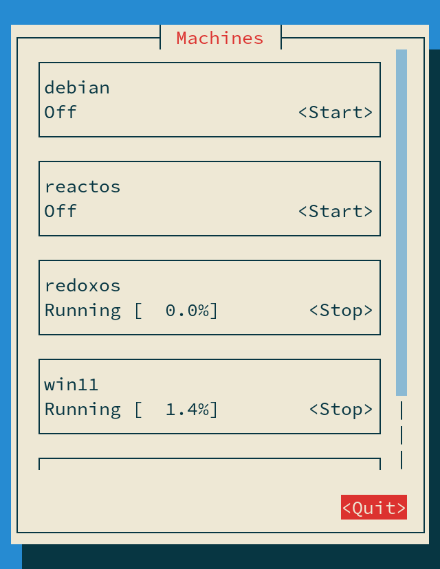

# `tvmm` - Tiny Virtual Machine Manager

A simple text UI program for managing (well, starting and stopping) QEMU virtual machines
through [`libvirt`](https://libvirt.org/).

## Use case

I use it to manage VMs via SSH on my phone,
it's easier than typing `virsh` commands on a mobile keyboard.

## License

Mozilla Public License 2.0
